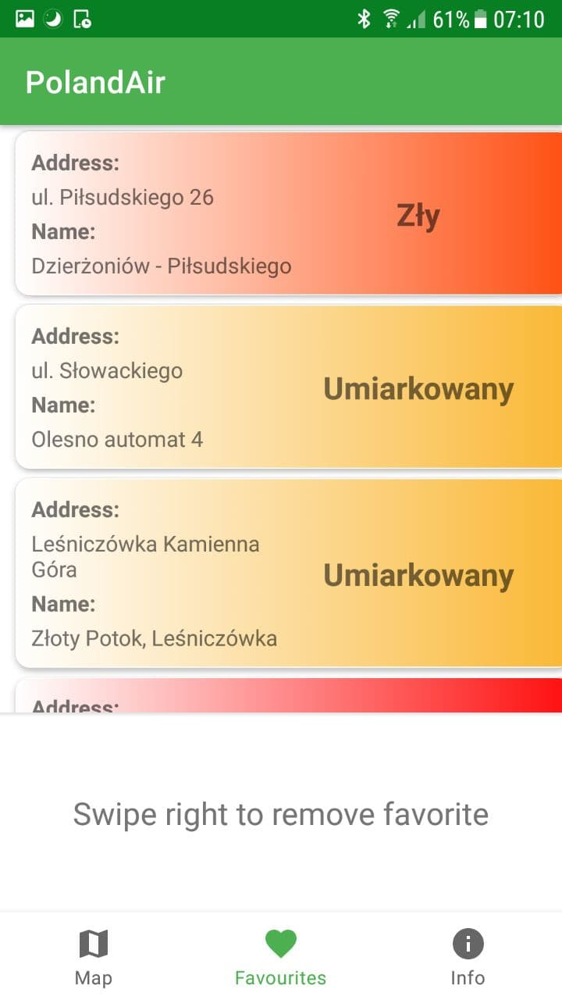
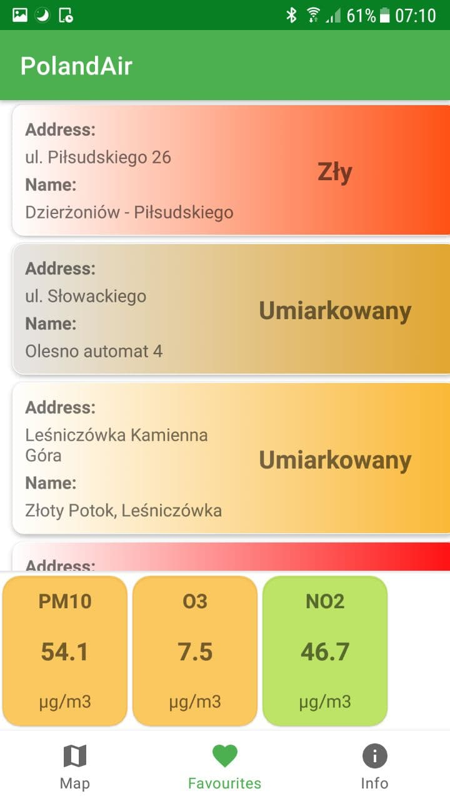
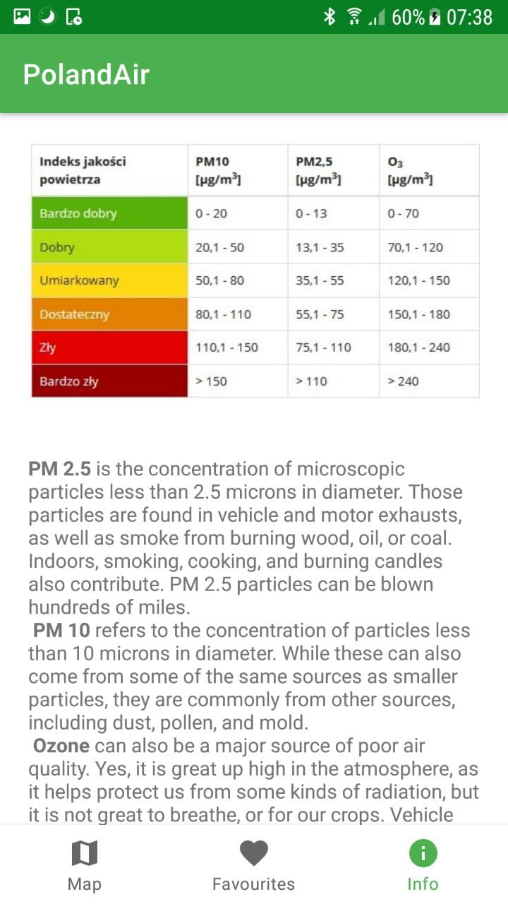

# PolandAir

Application that allows monitoring air pollution in Poland. The pollution data used are retrieved using API of GIOS
(Główny Inspektorat Ochrony Środowiska)

## Features

- A browsable map of Poland, where stations are loaded dynamically.
- Favorites feature for stations for an easy access.
- Graphs of pollution of the stations in the last few hours.
- General helpful information about pollutants and pollution levels.

## Screenshots

 

